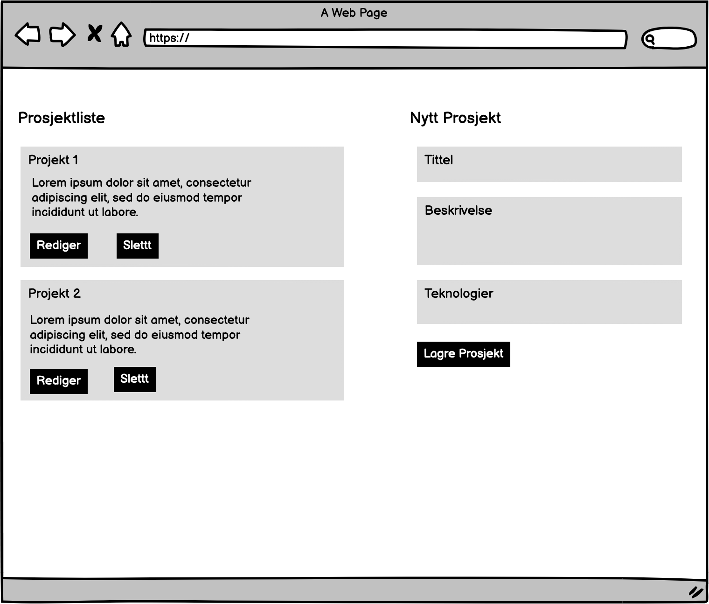
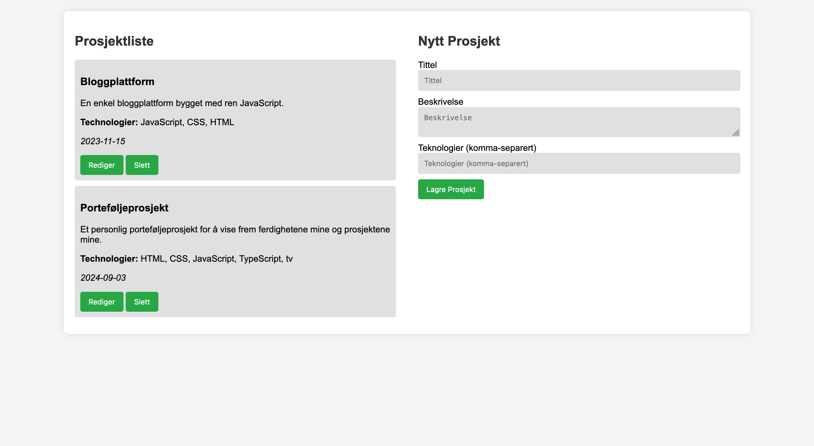
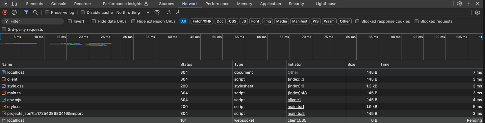

# School project

This project is a portfolio application built to showcase different projects, skills, and information about the developer. The focus of this application is on learning HTML, CSS, JavaScript, TypeScript, and setting up a basic server using Hono. This project is part of an educational course aimed at building a comprehensive portfolio.

## Project Overview

The portfolio application allows users to:

- View a list of projects.
- Add new projects with a title, description, and list of technologies used.
- Edit or delete existing projects.

### Features

- **HTML, CSS, JavaScript**: Basic web technologies to create the structure, style, and interactivity of the portfolio.
- **TypeScript**: Provides better type safety and improves the maintainability of the JavaScript code.
- **Hono Server**: A simple server setup using Hono to manage backend operations such as storing and retrieving project data.

### Learning Objectives

- Create sequence diagrams for POST and GET operations.
- Design a wireframe for project listing and creation.
- Structure data in JSON format.
- Implement basic HTML, CSS, and JavaScript for the portfolio application.
- Use TypeScript for better type safety.
- Set up a simple server with Hono.

## Wireframe

Below is the wireframe for the project page that displays all projects and allows for the creation of new projects:



## Screenshot

Here is a screenshot of the current state of the application:



### Network Panel

Here is the screenshot of the network panel showing the relevant network requests:



## How to Run the Project

### Prerequisites

- **Node.js**: Ensure Node.js is installed on your machine to run the server and frontend tools.

### Frontend

1. **Navigate to the project directory**:
   ```bash
   cd portfolio-1

    Install dependencies:

    bash

npm install

Start the frontend development server:

bash

    npm run dev

    This command will start a development server. Open your browser and navigate to the URL provided by the terminal output (usually http://localhost:3000).

Backend

    Ensure you are in the project directory:

    bash

cd portfolio-1

Install Hono (if not already installed):

bash

npm install hono

Run the Hono server:

bash

    node server/server.js

    Make sure to replace server/server.js with the correct path to your server file. The server will start running on the specified port (usually 3000 or as configured in your server file).

    Access the backend endpoints: You can now make requests to the backend server at http://localhost:3000 (or the configured port).

Technologies Used

    HTML & CSS: For structure and styling.
    JavaScript & TypeScript: For interactivity and type safety.
    Hono: A lightweight web framework for handling server-side logic.
    JSON: For data storage and retrieval.
