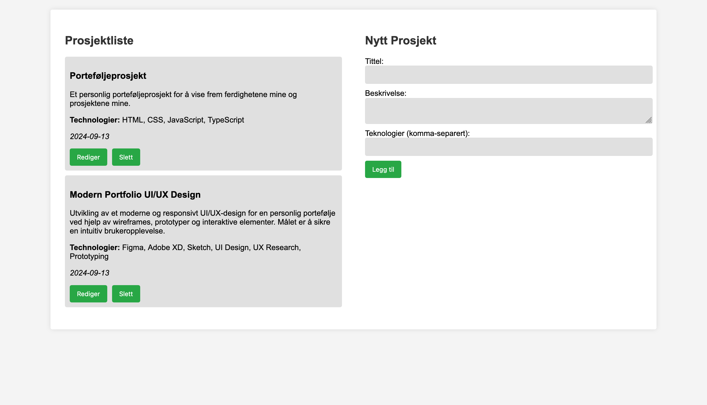

Portfolio- v2
Project Overview

This version builds upon the initial portfolio project by:

    Converting the frontend to React for a better development experience and dynamic updates.
    Setting up a Node.js backend using the Hono framework.
    Integrating backend API endpoints to fetch, add, update, and delete project data stored in a JSON file.
    Utilizing TypeScript for enhanced type safety on both frontend and backend.
    CORS configuration to ensure communication between the frontend and backend.

Features

    Frontend built with React:
        Dynamically displays a list of projects.
        Forms to add and update projects.
        Option to delete projects.

    Backend with Hono and Node.js:
        Provides API endpoints to handle:
            GET: Fetch all projects.
            POST: Add a new project.
            POST (update): Update an existing project.
            POST (delete): Remove a project.

    Data Persistence:
        The project data is saved and loaded from a JSON file on the backend (projects.json).

The design of the application is based on the following layout:

Project Structure
Frontend

    React handles the UI components and dynamic rendering.
    TypeScript ensures type safety and better development practices.
    Vite is used as the build tool for fast and optimized bundling.

Backend

    Node.js runs the backend server.
    Hono is used to manage routing and handle API requests.
    TypeScript is also used in the backend to maintain consistency and type safety.

API Endpoints
GET / (Fetch Projects)

Fetch all projects stored in the JSON file.
POST /add (Add Project)

Add a new project to the JSON file.
POST /update (Update Project)

Update the details of an existing project.
POST /delete (Delete Project)

Delete a project from the JSON file.
How to Run the Project
Prerequisites

    Node.js should be installed.
    npm for package management.

Frontend

    Navigate to the frontend folder:

    bash

cd frontend

Install dependencies:

bash

npm install

Start the development server:

bash

    npm run dev

    The frontend will run on http://localhost:5173.

Backend

    Navigate to the backend folder:

    bash

cd backend

Install backend dependencies:

bash

npm install

Start the backend server:

bash

    npm start

    The backend will run on http://localhost:3000.

Project Screenshots

Here’s a screenshot of the current portfolio app:

Technical Stack

    React: Frontend framework for building UI components.
    TypeScript: Used for type safety and code clarity.
    Hono: Lightweight web framework for the backend.
    Node.js: JavaScript runtime for the backend.
    Vite: Bundler and development tool for React.
