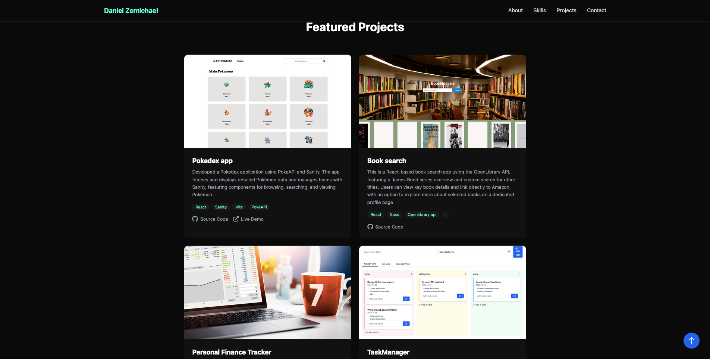
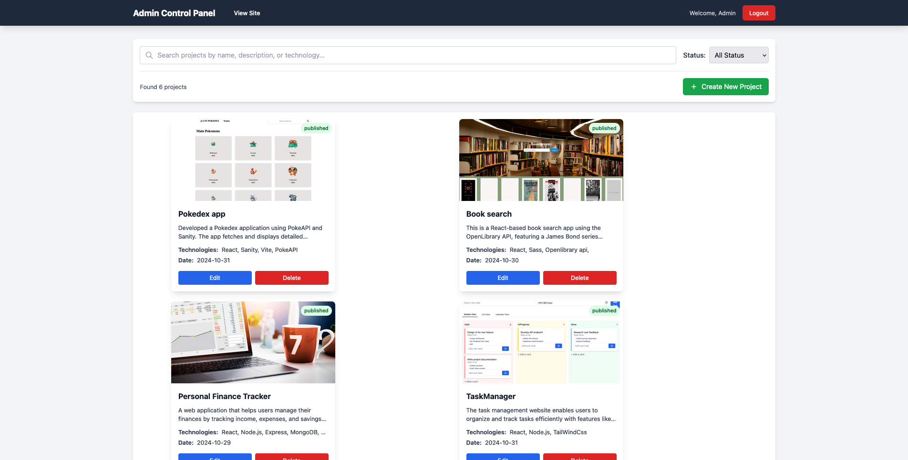

# Portfolio Project

A full-stack portfolio application designed to showcase development projects through an intuitive and modern interface. Built with React and TypeScript for a robust frontend, complemented by a Hono backend framework for efficient API handling and SQLite database for reliable data storage. The application features two distinct interfaces: a public user dashboard where visitors can explore projects, view technical details, and access live demos, and a secure admin dashboard that provides comprehensive project management capabilities. This dual-interface approach allows for both effective project presentation to the public and streamlined content management for administrators.

The application emphasizes clean architecture, type safety through TypeScript, and modern development practices. Key technical features include JWT authentication for secure admin access, dynamic image upload and management, real-time project updates, and a responsive design that ensures optimal viewing across all devices. The use of SQLite with Prisma ORM provides a reliable and efficient data layer, while the Hono framework offers lightweight yet powerful backend capabilities, making the application both performant and maintainable.

## Demo

### User Dashboard
*Public view of projects with filtering and detailed project information*

### Admin Dashboard
*Protected admin interface for managing projects*

## Features

- **User Dashboard**: Public view of projects with responsive design
- **Admin Dashboard**: Secure area for managing projects (CRUD operations)
- **Image Upload**: Support for project images
- **Authentication**: Secure login system for admin access
- **Responsive Design**: Mobile-friendly interface
- **Modern Stack**: React, TypeScript, Hono, SQLite, Prisma

## Prerequisites

Before you begin, ensure you have installed:
- Node.js (v14 or higher)
- npm (comes with Node.js)
- Git
- SQLite3

## Installation

1. Clone the repository:
   bash
   git clone:
   cd port.....

2. Install dependencies for both frontend and backend:
   bash
  Install root dependencies
  npm install

  Install frontend dependencies
  cd frontend
  
  npm install
  Install backend dependencies
  
  cd ../backend
  npm install

3. Create a `.env` file in the backend directory with the following content:
   env
   - JWT_SECRET=your_secret_key_here
   - ADMIN_USERNAME=admin
   - ADMIN_PASSWORD=password123

4. Set up the SQLite database using Prisma:
   bash
  cd backend

         - Generate Prisma client
           npx prisma generate
   
         - Run migrations
            npx prisma migrate reset
         
         - Seed the database
            npx prisma db seed

 This will:
- Create the SQLite database file
- Apply all migrations
- Generate the Prisma client

## Running the Application

1. Start both frontend and backend servers:
  bash
  From the root directory
  npm run dev

  This will start:
  - Frontend server at: http://localhost:5173
  - Backend (Hono) server at: http://localhost:3000

## Testing the Application

### User Dashboard
1. Access the user dashboard by visiting:
   http://localhost:5173/user-dashboard
   
  Here you can:
    - View all published projects
    - Filter projects by technology
    - View project details including:
    - Project descriptions
    - Technologies used
    - GitHub links
    - Live demos

### Admin Dashboard
1. Access the admin login page:
   http://localhost:5173/login

2. Login credentials:
   Username: admin
   Password: password123

3. Test admin features:
- Create new projects
- Upload project images
- Edit existing projects
- Delete projects
- Toggle project visibility (public/private)
- Manage project status (draft/published)

## Project Structure

      ├── frontend/ # React frontend application
      │ ├── src/
      │ │ ├── components/ # React components
      │ │ ├── types/ # TypeScript type definitions
      │ │ └── config/ # Configuration files
      │ └── public/ # Static assets
      ├── backend/ # Hono backend application
      │ ├── prisma/ # Database schema and migrations
      │ │ ├── schema.prisma # Database schema
      │ │ └── migrations/ # SQLite migrations
      │ ├── uploads/ # Project image uploads
      │ └── server.mjs # Main Hono server file

## Database Schema

The SQLite database includes the following main tables:
- `Project`: Stores project information
- `User`: Stores admin credentials

Key project fields:
- title
- description
- technologies (JSON)
- date
- status
- media
- githubUrl
- liveUrl

## API Endpoints

The Hono backend provides these main endpoints:

### Public Endpoints
- `GET /api/projects`: Get all public projects
- `GET /api/projects/:id`: Get specific project

### Protected Admin Endpoints
- `POST /api/login`: Admin authentication
- `POST /api/projects/add`: Create new project
- `POST /api/projects/update/:id`: Update project
- `POST /api/projects/delete`: Delete project

## Troubleshooting

If you encounter any issues:

1. Database Issues:
   - Check if SQLite database file exists in `backend/prisma/projects.db`
   - Run `npx prisma migrate reset` to reset the database
   - Verify Prisma schema matches your needs

2. Server Issues:
   - Ensure ports 3000 and 5173 are available
   - Check backend logs for Hono server errors
   - Verify `.env` configuration

3. Image Upload Issues:
   - Verify `uploads` directory exists and has write permissions
   - Check file size limits
   - Ensure proper file types (PNG, JPG, GIF)

## Development Tools

Useful commands for development:

  bash
  View database content
  cd backend
  npx prisma studio
  
  Reset database
  npx prisma migrate reset
  
  Generate new migration
  npx prisma migrate dev --name migration_name

